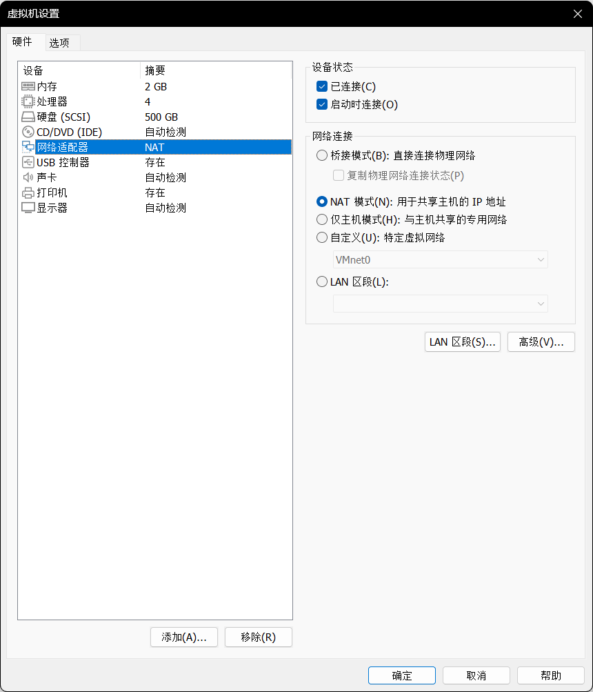

# Android 远程控制复现

## 实验环境

- ADB
- AndroidKiller
- Vmware
- crackme02.apk

## 实验过程

首先是虚拟机配置方面，因为我在宿主机上安装了 `ADB` 以及 `AndroidKiller` ，所以网卡就不需要配置成桥接模式了， `NAT` 模式就可以满足此次实验的要求。



接下来打开虚拟机，查看一下该虚拟机的 `IP` 地址，


`IP` 地址为 `192.168.5.129`，接下来在宿主机上使用 `ADB` 连接，具体命令如下：

```json
adb connect 192.168.5.129
```


出现如上字符就说明已经连接成功。

接下来使用 `AndroidKiller` 打开老师提供的 `APK` ，


可以看到这个程序还是比较简单的，我们先在虚拟机装上这个应用，看一看这个应用大致提供了什么服务。

首先我们在上方工具栏的设备中选择已经连接的设备


接下来点击右边的安装即可，安装完成后下方会显示成功安装的字样。


该应用应该是实现了注册的功能，我们需要输入正确的注册码就可以成功注册。


那么我们的任务就清楚了，就是要找到存储注册码的位置。

分析代码我们发现一个叫做 `checkSN` 的方法，这里应该就是实现校验注册码的地方。


接下来我们进入这个方法，具体地分析一下

```java
.method private checkSN(Ljava/lang/String;Ljava/lang/String;)Z
    .locals 10
    .param p1, "userName"    # Ljava/lang/String;
    .param p2, "sn"    # Ljava/lang/String;

    .prologue
    const/4 v7, 0x0

    .line 54
    if-eqz p1, :cond_0

    :try_start_0
    invoke-virtual {p1}, Ljava/lang/String;->length()I

    move-result v8

    if-nez v8, :cond_1

    .line 76
    :cond_0
    :goto_0
    return v7

    .line 56
    :cond_1
    if-eqz p2, :cond_0

    invoke-virtual {p2}, Ljava/lang/String;->length()I

    move-result v8

    const/16 v9, 0x10

    if-ne v8, v9, :cond_0

    .line 58
    const-string v8, "MD5"

    invoke-static {v8}, Ljava/security/MessageDigest;->getInstance(Ljava/lang/String;)Ljava/security/MessageDigest;

    move-result-object v1

    .line 59
    .local v1, "digest":Ljava/security/MessageDigest;
    invoke-virtual {v1}, Ljava/security/MessageDigest;->reset()V

    .line 60
    invoke-virtual {p1}, Ljava/lang/String;->getBytes()[B

    move-result-object v8

    invoke-virtual {v1, v8}, Ljava/security/MessageDigest;->update([B)V

    .line 61
    invoke-virtual {v1}, Ljava/security/MessageDigest;->digest()[B

    move-result-object v0

    .line 62
    .local v0, "bytes":[B
    const-string v8, ""

    invoke-static {v0, v8}, Lcom/droider/crackme0201/MainActivity;->toHexString([BLjava/lang/String;)Ljava/lang/String;

    move-result-object v3

    .line 63
    .local v3, "hexstr":Ljava/lang/String;
    new-instance v5, Ljava/lang/StringBuilder;

    invoke-direct {v5}, Ljava/lang/StringBuilder;-><init>()V

    .line 64
    .local v5, "sb":Ljava/lang/StringBuilder;
    const/4 v4, 0x0

    .local v4, "i":I
    :goto_1
    invoke-virtual {v3}, Ljava/lang/String;->length()I

    move-result v8

    if-lt v4, v8, :cond_2

    .line 67
    invoke-virtual {v5}, Ljava/lang/StringBuilder;->toString()Ljava/lang/String;

    move-result-object v6

    .line 70
    .local v6, "userSN":Ljava/lang/String;
    invoke-virtual {v6, p2}, Ljava/lang/String;->equalsIgnoreCase(Ljava/lang/String;)Z

    move-result v8

    if-eqz v8, :cond_0

    .line 76
    const/4 v7, 0x1

    goto :goto_0

    .line 65
    .end local v6    # "userSN":Ljava/lang/String;
    :cond_2
    invoke-virtual {v3, v4}, Ljava/lang/String;->charAt(I)C

    move-result v8

    invoke-virtual {v5, v8}, Ljava/lang/StringBuilder;->append(C)Ljava/lang/StringBuilder;
    :try_end_0
    .catch Ljava/security/NoSuchAlgorithmException; {:try_start_0 .. :try_end_0} :catch_0

    .line 64
    add-int/lit8 v4, v4, 0x2

    goto :goto_1

    .line 72
    .end local v0    # "bytes":[B
    .end local v1    # "digest":Ljava/security/MessageDigest;
    .end local v3    # "hexstr":Ljava/lang/String;
    .end local v4    # "i":I
    .end local v5    # "sb":Ljava/lang/StringBuilder;
    :catch_0
    move-exception v2

    .line 73
    .local v2, "e":Ljava/security/NoSuchAlgorithmException;
    invoke-virtual {v2}, Ljava/security/NoSuchAlgorithmException;->printStackTrace()V

    goto :goto_0
.end method
```

也就是说 `checkSN` 方法接受两个参数，分别是用户名和序列号。如果用户名为空或长度为零，或者序列号为空或长度不为 16 个字符，则返回 false。否则，该方法将用户名转换为 MD5 哈希值，并将其转换为十六进制字符串。然后，该方法将该字符串的每个字符转换为小写字母，并将其与序列号进行比较。如果它们相等，则返回 true，否则返回 false。如果在计算 MD5 哈希值时发生异常，则返回 false。

那么我们就大致知道了破解思路，也就是说让它在进行比较之前打印出加密后的字符串，这样我们就可以获得加密后的字符串。我们可以调用 `Log` 类的 `d(String, String)` 方法输出调试信息到日志中，第一个参数是用于标识日志输出的标签（tag），通常用于区分不同的日志输出来源，第二个参数是要输出的具体信息。

我们在 `equalsIgnoreCase`之前增加

```java
const-string v11, "deng"
invoke-static {v11, v6}, Landroid/util/Log;->d(Ljava/lang/String;Ljava/lang/String;)I
```

将字符串常量  `deng` 存储在寄存器 `v11` 中，使用 `deng`作为标签，`v6` 是要输出的信息（局部变量 `userSN` 的值）。因为我们这里多使用了一个寄存器，所以在前面定义的时候要将寄存器的个数加一，即将原来的10个改为11个。

```java
.method private checkSN(Ljava/lang/String;Ljava/lang/String;)Z
    .locals 11
    .param p1, "userName"    # Ljava/lang/String;
    .param p2, "sn"    # Ljava/lang/String;
```

修改完毕后，在虚拟机中将我们一开始安装的 `crackme02`删除，然后点击 `AndroidKiller`上方工具栏的编译，编译完成后安装我们修改后的 `APK` 。安装完成后我们开始运行，并且打开`AndroidKiller`中的日志。


然后在虚拟机中输入用户名和16位的注册码，点击注册。


这时候查看日志信息，我们可以看到一个名为 `deng`的字符串，其对应的值 `2a373812d21716a4`就是加密后的值。


我们将这个值输入就可以成功注册了。

