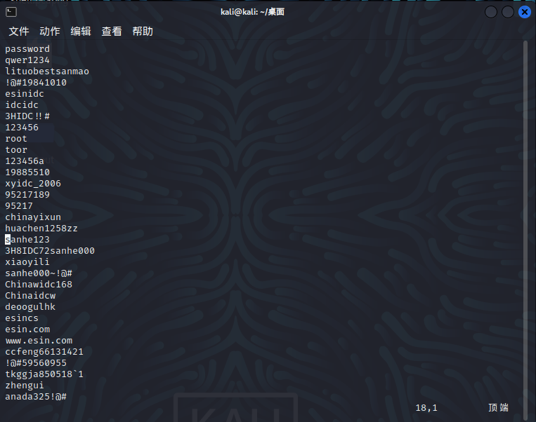
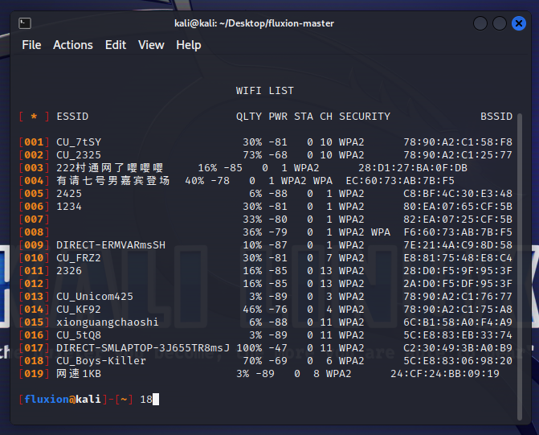
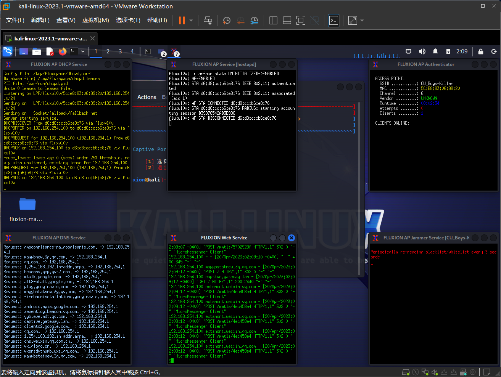

# 实验一 使用Aircrack-ng进行wifi渗透

## 实验环境

* kali 2022.3
* Ralink 802.11 n WLAN
* 路由器

## 实验过程

首先载入无线网卡驱动，激活无线网卡至monitor（监听模式），使用命令

```shell
airmon-ng start wlan0
```

使用该命令后，网卡会自动改名为`wlan0mon`


接下来探测周围的wifi，找到我们要攻击的目标，使用命令

```shell
airodump-ng wlan0mon
```


我们要破解的`wifi`是`rockjames`，我们需要记住该wifi 的mac地址以及它所在的频道，从上图中可以得到该wifi的mac地址为`20:F4:1B:95:1B:18`，频道为`11`，接下来开始对该wifi抓包，

```shell
airodump-ng --ivs -c 11 --bssid 20:F4:1B:95:1B:18 -w test wlan0mon
```


可以发现我们抓到了eapol包，接下来就可以对该WiFi进行暴力破解，我们使用WiFi常见密码本



使用命令

```shell
aircrack-ng -w /home/kali/桌面/wifi密码本.txt test-01.ivs
```

* `test-01.ivs`就是我们刚刚抓到的包含`eapol`的流量包


那么这样我们就得到了该wifi的密码为87654321。

# 实验二基于setoolkit的钓鱼实验

## 实验环境

* kali 2022.3
* setoolkit

## 实验过程

kali命令行打开工具


选择社会工程学攻击，接下来跳转至第二次选项，选择「网页攻击」


接下来跳转至第三次选项，选择「钓鱼攻击」


接下来跳转至第四次选项，选择「站点克隆」


`setoolkit`要求输入克隆完之后的网站返回的ip地址，我们使用虚拟机的地址，所以这里直接回车即可


在浏览器中输入虚拟机的ip，即可跳转到钓鱼网站的页面,外观与被克隆的页面完全一致


我们在伪造的站点输入账号密码，即可在kali中看到账号和密码


# 实验三 基于fluxion的钓鱼实验

## 实验环境

* kali 2023.1
* Ralink 802.11 n WLAN
* fluxion 5.9

## 实验过程

首先是`fluxion`安装的问题，在安装过程中可能会遇到有一些依赖无法安装的问题，具体的参考这篇[文章](https://ourcodeworld.com/articles/read/961/how-to-solve-kali-linux-apt-get-install-e-unable-to-locate-package-checkinstall)，如果修改源之后遇到下面的问题


我的解决办法是安装`aptitude`，再通过`aptitude`安装相关依赖即可。

安装好相关依赖之后就可以进行wifi钓鱼了，使用命令

```shell
sudo ./fluxion.sh
```

启动fluxion，选择简体中文，接着选择`专属门户 创建一个“邪恶的双胞胎"接入点`


接着选择`扫描所有信道(2 .4GHz )`，当然选择其余两个也都是可以的


扫描到我们想要钓鱼的wifi即可停止，以我们宿舍的wifi为例


停止之后选择该wifi(前面不要加0)



接着选择无线接口，这里选择我们使用的网卡`wlan0`即可


接着为接入点选择一个接口，我们继续选择刚才选择的网卡`wlan0`即可


选择一个接入点，选择它推荐的即可


接下来就要抓取握手包了，使用aireplay-ng 解除认证方式


 选择Hash的验证方法，我们选择推荐的即可


每隔30s检查一次握手包


使用Synchronously的方式进行验证


接下来就需要使用自己的手机连接以下该wifi，如果成功抓到握手包就会弹出提示


接下来就进行验证即可，选择使用抓取到的 hash文件


选择钓鱼认证门户的SSL证书来源，我们创建一个即可


为流氓网络选择 Internet连接类型，选择推荐的即可


选择通用认证网页(chinese)


接下来就会弹出6个窗口，这就验证所有的操作无误，已经成功开启了钓鱼热点



现在使用手机查看一下附近的wifi，确实有一个叫`CU_Boys-Killer`，并且是一个没有密码的wifi


接下来我们连接到该wifi，会弹出一个网页


如果我们在这里输入了WiFi密码，kali就会自动保存该wifi的密码


这里就可以看到该wifi的密码了。
